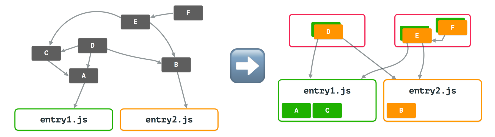

srcgraph code splits ES6 modules.
It accepts multiple JS module entrypoints, and returns the minimum number of modules required to represent the source graph.

## Example



On the left, we have an abstract dependency graph.
Imagine that `entry1.js` looks like—

```js
// entry1.js
import './A.js';
```

and `A.js` imports C, and D etc.

The right side is the output of srcgraph.

### Process

srcgraph walks the dependency graph, marking each node with the entry points that use it.
Nodes that are used by only one entry point are merged into their module.

However, the remaining nodes (D, E and F) can't be naïvely bundled into a big bag.
Because D and E have unique ways in which they are used, we turn them into individual modules so that the entry points of D and E are still exposed.
Conceptaully we've just made the D and E modules 'bigger' (well, D remains the same size).
They still export the same entry points.

## Usage

### Graph

To determine the minimum number of modules needed for a complex dependency graph, include and use `graph.js`.
(You can check out the code and run this yourself!)

```js
const graph = require('./graph.js');
graph(['demo/src/entry1.js', 'demo/src/entry2.js']).then((modules) => {
  modules.forEach((module) => {
    console.info(module);
  });
  // modules contains an array of:
  // Module{id: './test/entry1.js', srcs: ['./test/entry1.js', './test/A.js', './test/C.js']}
  // Module{id: './test/D.js', srcs: ['./test/D.js']}
  // .. and so on
});
```

These modules can be used as arguments to [Rollup](https://rollupjs.org/).
Generate a matching number of modules that include only those src files, and assume all other dependencies are external.

### Gulp Plugin

The Gulp plugin, provided in `plugin.js` (or as `require('srcgraph').gulp`, if you're using this via a package manager), invokes the graph algorithm as well as running Rollup.

```js
const gulp = require('gulp');
const srcgraph = require('srcgraph').gulp;

gulp.task('rollup', function() {
  const options = {};
  return gulp.src(['path/to/your/entrypoints/*.js'])
    .pipe(srcgraph(options))
    .pipe(gulp.dest('./dist'));
});
```

This will generate the minimum number of modules needed inside `dist`.

## License

This is available under an [Apache2 license](LICENSE).
